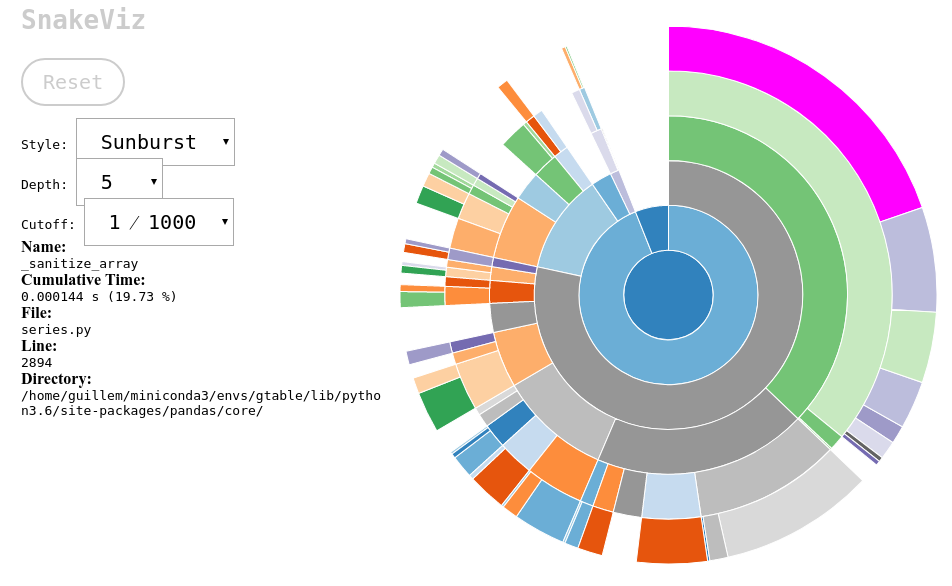

Motivation
==========

One important issue that beomes evident if you is use the Pandas
Dataframe very often is that, while it's a terrific class for data
analysis, it's that it's not a very good container for data. This
notebook is a short explanation on why one may want to reduce an
hypothetical intensive use of the Pandas Dataframe and to explore some
other solutions. None of this is a criticism about Pandas. It is a game
changer, and I am a strong advocate for its use. It's just that we hit
one of its limitations. Some simple operations just have too much
overhead.

To be more precise, let's start by importing Pandas

.. code:: ipython3

    import pandas as pd
    import numpy as np
    
    df = pd.DataFrame({'a': np.arange(1E6), 'b': np.arange(1E6)})

We have just created a relatively large dataframe with some dummy data,
enough to prove my initial point. Let's see how much time it takes to
add the two columns and to insert the result into the third one.

.. code:: ipython3

    %%timeit
    df.c = df.a + df.b

.. parsed-literal::

    3.01 ms ± 20.5 µs per loop (mean ± std. dev. of 7 runs, 100 loops each)

Is that fast or slow? Well, let's try to make the very same computation
in a slightly different manner

.. code:: ipython3

    a = df.a.values
    b = df.b.values

.. code:: ipython3

    %%timeit
    c = a + b

.. parsed-literal::

    2.86 ms ± 12.1 µs per loop (mean ± std. dev. of 7 runs, 100 loops each)

If we compare how fast it is to a simple sum of two numpy arrays, it is
pretty fast. But we are adding two relatively large arrays. Let's try
the exact same thing with smaller arrays.

.. code:: ipython3

    df = pd.DataFrame({'a': np.arange(100), 'b': np.arange(100)})

.. code:: ipython3

    %%timeit
    df.c = df.a + df.b

.. parsed-literal::

    95.5 µs ± 114 ns per loop (mean ± std. dev. of 7 runs, 10000 loops each)

.. code:: ipython3

    a = df.a.values
    b = df.b.values

.. code:: ipython3

    %%timeit
    c = a + b

.. parsed-literal::

    599 ns ± 3.7 ns per loop (mean ± std. dev. of 7 runs, 1000000 loops each)

Now things have changed quite a lot. Just adding two arrays takes two
orders of magnitude less than adding from the Pandas Dataframe. But this
comparison is not fare at all. Those 145µs are not spent waiting. Pandas
does lots of things with the value of the Series resulting from the sum
before it inserts it to the dataframe. If we profile the execution of
that simple sum, we'll see that almost a fifth of the time is spent on a
function called ``_sanitize_array``.

The most important characteristic of Pandas is that it always does what
it is supposed to do with data regardless of how dirty, heterogeneous,
sparse (you name it) your data is. And it does an amazing job with that.
But the price we have to pay are those two orders of magnitude in time.

That is exactly what impacted the performance of our last project. The
Dataframe is a very convenient container because it always does
something that makes sense, therefore you have to code very little. For
instance, take the ``join`` method of a dataframe. It does just what it
has to do, and it is definitely not trivial. Unfortunately, that
overhead is too much for us.

We are in the typical situation where abstractions are not for free. The
higher the level, the slower the computation. This is a kind of a
*second law of Thermodynamics* applied to numerical computing. And there
are abstractions that are tremendously useful to **us**. A Dataframe is
not a dictionary of arrays. It can be indexed by row and by column, and
it can operate as a whole, and on any imaginable portion of it. It can
sort, group, joing, merge... You name it. But if you want to compute the
payment schedule of all the securities of an entire bank, you may need
thousands of processors to have it done in less than six hours.

This is where I started thinking. There must be something in between.
Something that is fast, but it's not just a dictionary of numpy arrays.
And I started designing gtable

.. code:: ipython3

    from gtable import Table
    
    tb = Table({'a': np.arange(1E6), 'b': np.arange(1E6)})

.. code:: ipython3

    %%timeit
    tb.c = tb.a + tb.b

.. parsed-literal::

    3.16 ms ± 11.5 µs per loop (mean ± std. dev. of 7 runs, 100 loops each)

You can see that for large arrays, the computation time shadows the
overhead. Let's see how well it does with smaller arrays

.. code:: ipython3

    tb = Table({'a': np.arange(100), 'b': np.arange(100)})

.. code:: ipython3

    %%timeit
    tb.c = tb.a + tb.b

.. parsed-literal::

    8.51 µs ± 437 ns per loop (mean ± std. dev. of 7 runs, 100000 loops each)

We have improved by a factor of 7, which is crucial if that's the
difference between running in one or seven servers. We can still improve
the computation by a little bit more if we fallback into some kind of *I
know what I am doing* mode, and we want to reuse memory to avoid
allocations:

.. code:: ipython3

    %%timeit
    tb['a'] = tb['a'] + tb['b']

.. parsed-literal::

    2.17 µs ± 117 ns per loop (mean ± std. dev. of 7 runs, 100000 loops each)

Now the performance of arithmetic operations with gtable is closer to
operate with plain arrays to the overhead-driven performance of Pandas.
You can seriously break the table if you really don't know what you are
doing. But for obvious reasons, having this kind of performance tricks
is key to us.

Of course, these speedups come at a cost: features. Gtable is in its
infancy. There are literally two afternoons of work on it, and the whole
module fits within a single file with less than 300 lines of code. It is
pure python, and I have not started to seriously tune its performance.
But the idea of having something inbetween a Dataframe and a dictionary
of arrays with support for sparse information is appealing to say the
list.

